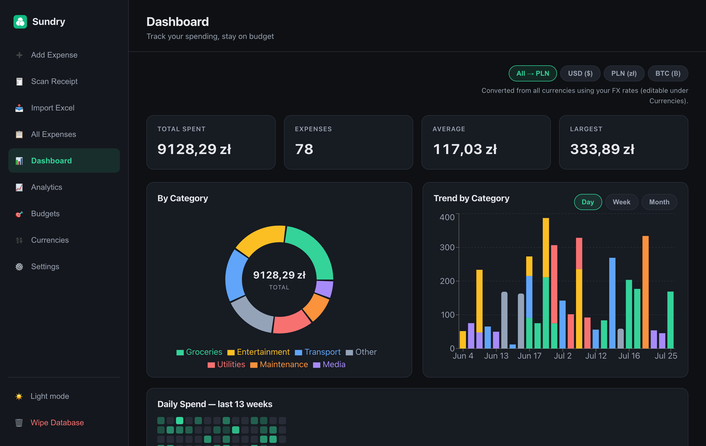
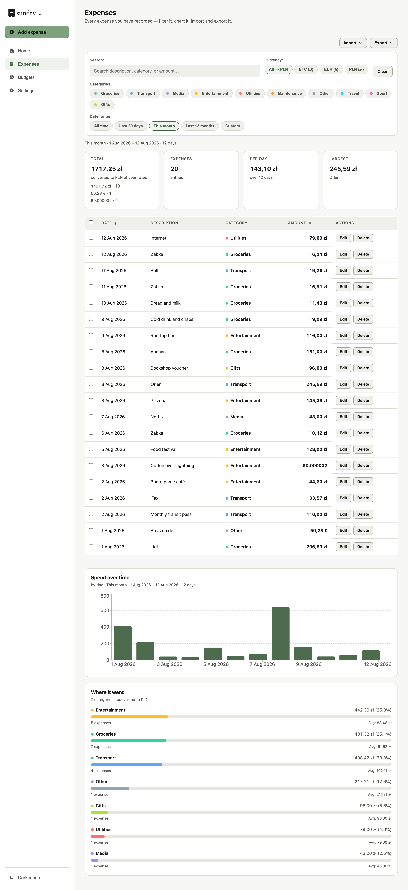
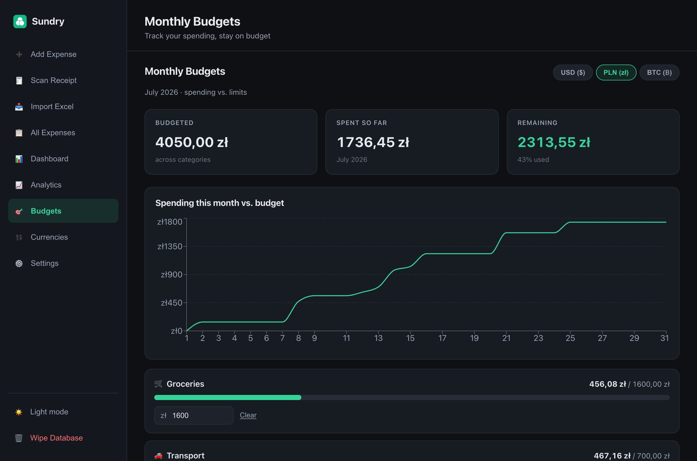
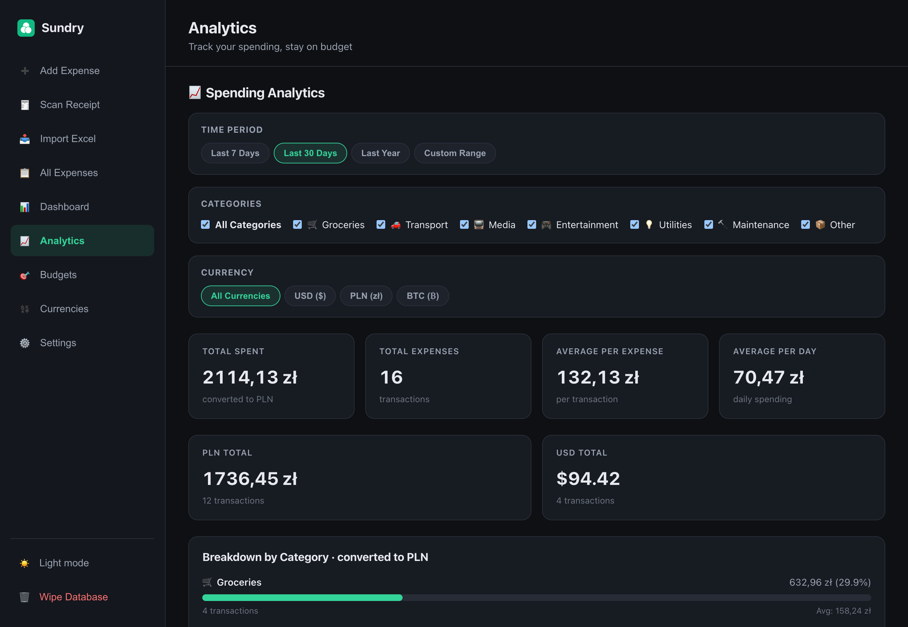
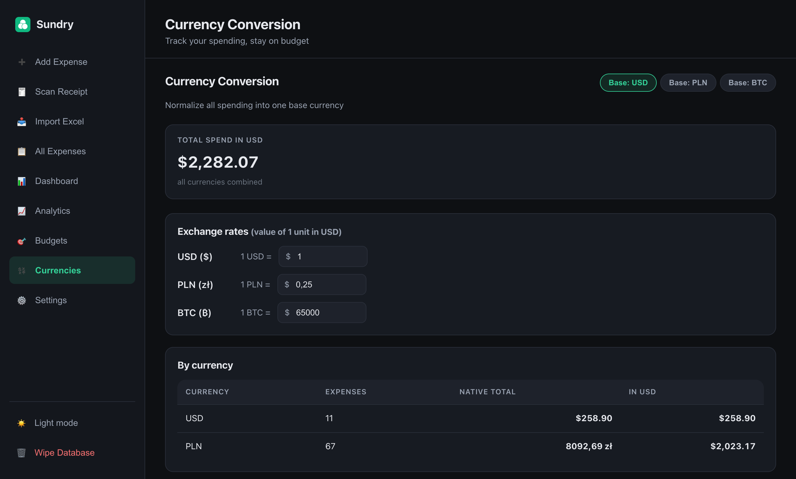
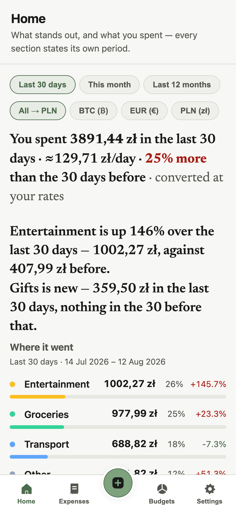

# Sundry

A self-hosted personal expense tracker. Add expenses by hand, snap a photo of a receipt, or bulk-import
a spreadsheet — then see where the money went across categories, time, and three currencies.

Runs entirely on your own hardware. No cloud, no account, no telemetry. One SQLite file holds everything.

**Stack:** TypeScript end to end — Express + better-sqlite3 on the back, React 18 + Vite on the front.



| Expenses | Budgets |
| :---: | :---: |
|  |  |
| **Analytics** | **Currencies** |
|  |  |

<p align="center">
  
</p>

## Quickstart

**Docker** — the whole stack behind nginx:

```bash
docker compose up --build
```

Open **http://localhost:8847**. Data persists in `./data`.

**Without Docker** — needs Node 18 or newer:

```bash
npm run install:all && npm run dev
```

Open **http://localhost:5173**. Vite proxies `/api` to the backend on `:5000`, so there is nothing else to
configure. To try the importer, use [`sample-data/sample-expenses.xlsx`](sample-data/sample-expenses.xlsx).

> The Docker images pin Node 18 and CI runs Node 20 — those are the tested versions. On newer releases
> better-sqlite3 ships no prebuilt binary and compiles from source, so you will need a C++ toolchain and
> Python installed.

### Sharing it across your devices

Run the stack on an always-on machine and every device on your LAN reaches the same data at
`http://<that-machine's-ip>:8847`. On a phone, open that URL and tap **Add to Home Screen** — it installs
as a full-screen PWA, and **Scan Receipt** opens the camera directly.

> **Set `APP_PASSWORD` before you expose this anywhere.** With no password the API is completely open —
> deliberate, so a localhost-only install needs zero setup, but it means anyone who can reach the port can
> read and delete your data. See [docs/DEPLOYMENT.md](docs/DEPLOYMENT.md).

## Features

- **Expenses** — add, edit, delete; search across description/category/amount; filter by category, currency
  and date range; sort by date, category or amount; select rows to bulk-assign a category or bulk-delete.
- **Receipt scanning** — photograph a receipt and the app pulls out amount, date and merchant. OCR runs
  **offline** by default (Tesseract.js, Polish + English), so no image leaves your server. You get a
  confidence score and per-field warnings, and you review and correct everything before it saves; the photo
  is attached to the expense.
- **Excel import** — upload an `.xlsx`, map the columns (common names are auto-detected), preview the first
  ten rows, then import. Handles merged cells, title rows and several date formats, and reports per-row
  errors instead of failing the batch.
- **Auto-categorization** — keyword matching in English and Polish, including Polish chains (Biedronka,
  Lidl, Żabka, Orlen, Castorama…) and utility providers (Tauron, PGE, Enea…). Shared by the importer and
  the receipt scanner. Matching is whole-word, so "scarf" is not transport and "photography" is not a game.
- **Budgets** — a monthly limit per category and currency, with per-category progress bars and a
  cumulative burn-down against the month's total.
- **Multi-currency** — USD, PLN and BTC (stored to satoshi precision). Totals are grouped per currency by
  default; set a primary currency and the dashboard converts everything into it using your own rates.
- **Analytics & dashboard** — category donut with a running total, stacked day/week/month trend, and a
  13-week daily-spend heatmap.
- **Export** — the whole ledger as `.xlsx` from the server, or CSV generated in the browser.
- **Optional login** — set `APP_PASSWORD` and the app gates behind a 7-day HMAC bearer token.
- **Dark-first UI, mobile layout, installable PWA** — with a light theme toggle.

## Design notes

The decisions worth explaining, and what I would revisit:

**Money is stored as integer minor units, never floats.** `amount` is an `INTEGER` column holding cents,
grosze or satoshis; the REST API speaks major units and conversion happens only at the model boundary
([`config/money.ts`](backend/src/config/money.ts)). A `REAL` column accumulates binary rounding error —
`0.1 + 0.2 !== 0.3` — which is invisible on one row and wrong on a thousand. BTC forced the issue: two
decimal places would have been useless, so the per-currency scale is explicit (100, 100, 100 000 000).

**better-sqlite3, synchronously.** This is a single-user app on a home server. An async driver plus a pool
would buy concurrency nobody needs, at the cost of every query becoming a promise. The prepared statements
in [`models/`](backend/src/models) are the entire data layer, and there is no ORM.

**Auth is opt-in, not off or on.** Most self-hosted trackers make you invent a password before you can add
your first expense. Here, no `APP_PASSWORD` means no gate — right for `localhost`. Setting it turns on an
HMAC bearer token. The tradeoff is real and stated loudly above rather than hidden in a config file.

**The OCR engine sits behind a provider seam.** [`services/receipt/`](backend/src/services/receipt) picks an
extractor from `RECEIPT_OCR_PROVIDER`; the parsing heuristics are pure functions with their own unit tests,
independent of whichever engine produced the text. Tesseract runs offline today; a hosted vision model can
drop in without touching routes or UI. Scanning is deliberately two-step — extract, then let the human
confirm — because OCR on a crumpled receipt is a suggestion, not a fact.

**What I would do differently.** The frontend and backend keep two hand-maintained copies of the same types
instead of a shared package, and they have already drifted once — a small workspace would have been cheaper
than the discipline. `routes/import.ts` grew business logic that belongs in a service, which is why it is
the least-tested file in the repo. And the Excel importer parses amounts with its own regex rather than
reusing the well-tested parser the receipt scanner already has; that is the next thing I would fix.

## Configuration

All backend variables are optional. There is no `.env` loading on the backend — export them in the
environment or set them in `docker-compose.yml`. See [`backend/.env.example`](backend/.env.example).

| Variable | Default | Purpose |
| --- | --- | --- |
| `PORT` | `5000` | API listen port |
| `DB_PATH` | `<cwd>/data/expenses.db` | SQLite file. Also roots the receipts and OCR-cache directories |
| `APP_PASSWORD` | *(unset — auth disabled)* | Enables the login gate |
| `AUTH_SECRET` | falls back to `APP_PASSWORD` | HMAC signing key for bearer tokens |
| `RECEIPT_OCR_PROVIDER` | `tesseract` | `tesseract` or `stub`. `claude` is a documented placeholder that throws |
| `RECEIPT_OCR_LANGS` | `pol+eng` | Tesseract language packs |
| `RECEIPTS_DIR` | `<dir of DB_PATH>/receipts` | Where receipt images are written |
| `TESSERACT_CACHE_PATH` | `<dir of DB_PATH>/tesseract` | Cache for downloaded language data |
| `TESSERACT_LANG_PATH` | *(unset)* | Point at local `*.traineddata` for fully offline OCR |

The frontend reads one variable, baked in at build time: `VITE_API_BASE_URL` (default `/api`).

## API

Base URL `http://localhost:5000/api`. Everything except `/health` and `/auth/*` requires
`Authorization: Bearer <token>` **when `APP_PASSWORD` is set** — otherwise all routes are open.

| Method | Path | Purpose |
| --- | --- | --- |
| `GET` | `/health` | Liveness check (public) |
| `GET` | `/auth/status` | Whether a password is configured (public) |
| `POST` | `/auth/login` | Exchange password for a 7-day token (public) |
| `GET` | `/expenses` | List expenses; filter by `category`, `currency`, `startDate`, `endDate` |
| `POST` | `/expenses` | Create one — `amount`, `date`, `description`, `category`, `currency` all required |
| `GET` | `/expenses/:id` | Fetch one |
| `PUT` | `/expenses/:id` | Partial update |
| `DELETE` | `/expenses/:id` | Delete one, plus its receipt image |
| `DELETE` | `/expenses/all` | Wipe everything and reset the id counter |
| `GET` | `/expenses/export` | Download the ledger as `.xlsx` |
| `GET` | `/expenses/stats/by-category` | Totals grouped by category and currency |
| `GET` | `/expenses/stats/by-date` | Totals grouped by date and currency |
| `GET` | `/expenses/stats/analytics` | Aggregates for a filtered slice |
| `POST` | `/import/preview` | Upload a spreadsheet, get headers + first 10 rows |
| `POST` | `/import/confirm` | Import using a column mapping |
| `POST` | `/receipts/scan` | OCR a photo and return fields for review — creates nothing |
| `POST` | `/receipts` | Create an expense from reviewed fields, attaching the photo |
| `GET` | `/receipts/:filename` | Stream a stored receipt image |
| `GET`, `PUT` | `/budgets` | List limits / upsert one for a category+currency pair |
| `DELETE` | `/budgets/:category` | Remove a limit (`?currency=` required) |
| `GET`, `PUT` | `/fx` | Read / set manual exchange rates |
| `GET`, `PUT` | `/settings` | Read / update preferences |

## Data model

Four tables — `expenses`, `budgets`, `fx_rates`, `settings` — created idempotently on boot.

**Categories** (CHECK-constrained): `groceries`, `transport`, `media`, `entertainment`, `utilities`,
`maintenance`, `other`.

**Currencies** (CHECK-constrained): `USD` (2dp), `PLN` (2dp), `BTC` (8dp).

**Exchange rates** are manual and user-editable — there is no live feed, because the app is meant to run
offline. A rate is the value of one unit in USD; seeds are `USD 1`, `PLN 0.25`, `BTC 65000`.

Adding a category or currency means a migration in
[`config/database.ts`](backend/src/config/database.ts), not just a type change.

## Development

```bash
npm run install:all   # root + backend + frontend
npm run dev           # both servers, backend :5000 + Vite :5173
npm run build         # typecheck and build both packages
npm run test          # backend Jest, then frontend Vitest
```

Tests: **92 backend cases** across 10 files (Jest + supertest) and **14 frontend cases** across 4 files
(Vitest + Testing Library). The backend suite redirects `DB_PATH` to a temp directory before any app module
loads, so running it never touches your real database. CI
([`.github/workflows/ci.yml`](.github/workflows/ci.yml)) typechecks, builds and tests both packages and
builds the Docker images.

The frontend is the under-tested half — 4 test files against 12 components. That is the honest gap.

## Limitations

Worth knowing before you rely on it:

- **Single user.** One password, one ledger. No accounts, no sharing model, no per-user data.
- **No pagination.** Every expense is fetched and rendered at once. Fine for the thousands a person
  actually records; not built for a hundred thousand.
- **Manual FX rates.** No live feed by design.
- **No recurring expenses**, no income tracking, no attachments beyond receipt photos.
- **Backups are your job** — copy the `data/` directory; it holds both the database and the receipt images.

## License

[MIT](LICENSE).
