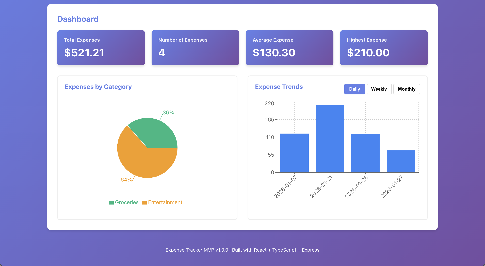
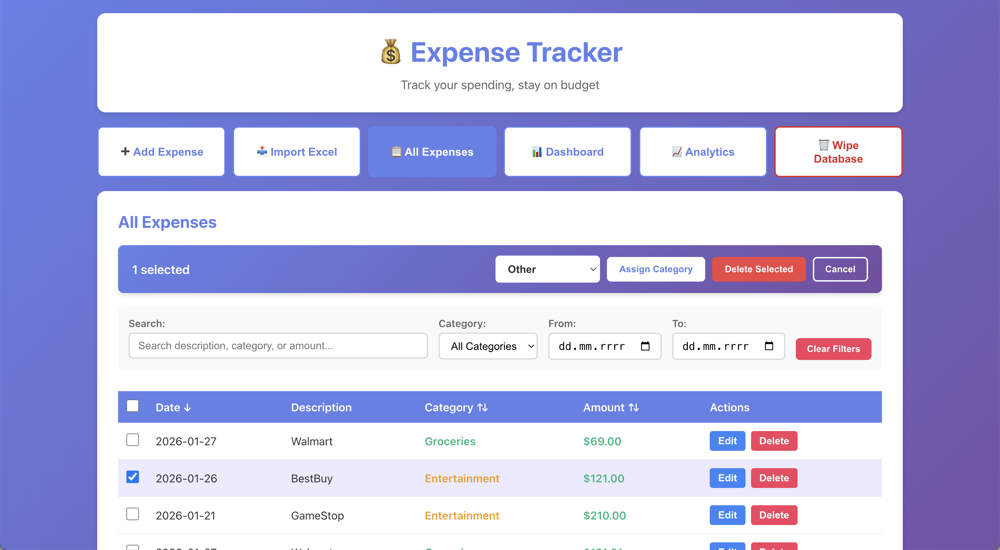
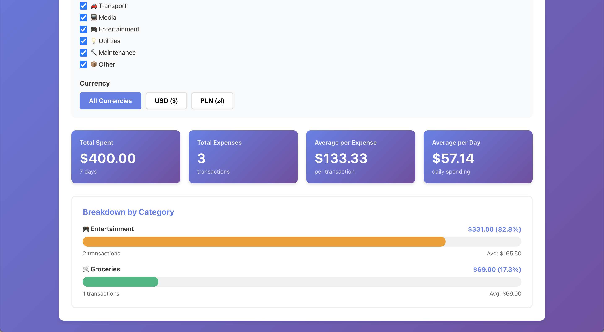

# 💰 Expense Tracker

A full-stack, self-hosted personal expense tracker built with **TypeScript**, **React**, **Express**, and **SQLite**. Add expenses, bulk-import them from Excel, and visualize spending across categories, time, and multiple currencies (USD / PLN / BTC). Runs entirely on your own hardware — no cloud, no account.

## 📸 Screenshots

| Dashboard | Expenses | Analytics |
| :---: | :---: | :---: |
|  |  |  |

## 🚀 Quickstart (Docker)

Run the whole stack with one command:

```bash
docker compose up --build
```

Then open **http://localhost:8847**. The frontend reaches the backend through an nginx reverse proxy, and your data persists in `./data`. To try the Excel import, use the included [`sample-data/sample-expenses.xlsx`](sample-data/sample-expenses.xlsx). For configuration and self-hosting notes, see [docs/DEPLOYMENT.md](docs/DEPLOYMENT.md).

### Or run locally without Docker

Requires **Node 18+**. From the project root:

```bash
npm run install:all   # install backend + frontend dependencies
npm run dev           # start both servers together
```

Then open **http://localhost:5173**. The Vite dev server proxies `/api` to the backend (on `:5000`), so there's nothing else to configure. See **Getting Started** below for the step-by-step version.

## ✨ Features

- **Add Expenses**: Simple form to add expenses with amount, date, description, and category
- **Excel Import**: Bulk import expenses from .xlsx files with:
  - Column mapping interface
  - Currency selection (USD, PLN)
  - Data preview before import
  - Validation and error reporting
  - Support for multiple date formats
  - Auto-categorization based on keywords
- **Multi-Currency Support**: Track expenses in USD and PLN
- **View All Expenses**: Table view with sorting and filtering capabilities
- **Dashboard**: Visual insights with:
  - Category-based pie chart
  - Time-based trend charts (daily/weekly/monthly)
  - Summary statistics (total, average, highest expense)
- **CRUD Operations**: Create, read, update, and delete expenses
- **Database Management**: Wipe all expenses with double confirmation
- **Filtering**: Filter by category and date range
- **Sorting**: Sort by date, amount, or category
- **Validation**: Client-side and server-side validation for data integrity
- **TypeScript**: Full type safety across frontend and backend
- **Responsive Design**: Works on desktop and mobile devices

## 🛠 Tech Stack

### Backend
- **Node.js** + **Express**: REST API server
- **TypeScript**: Type-safe backend code
- **SQLite** + **better-sqlite3**: Local database with synchronous API
- **xlsx**: Excel file parsing for imports
- **Multer**: File upload handling
- **Jest** + **Supertest**: API testing

### Frontend
- **React 18**: UI library with hooks
- **TypeScript**: Type-safe frontend code
- **Recharts**: Data visualization
- **Vite**: Fast build tool and dev server
- **Vitest**: Unit testing

## 📋 Prerequisites

- **Node.js** 18 or higher
- **npm** or **yarn**

## 🚀 Getting Started

### 1. Clone or Download the Project

```bash
cd expense-tracker
```

### 2. Install Backend Dependencies

```bash
cd backend
npm install
```

### 3. Install Frontend Dependencies

```bash
cd ../frontend
npm install
```

### 4. Start the Backend Server

```bash
cd ../backend
npm run dev
```

The backend server will start on **http://localhost:5000**

### 5. Start the Frontend Development Server

Open a new terminal:

```bash
cd frontend
npm run dev
```

The frontend will start on **http://localhost:5173** and automatically open in your browser.

## 📁 Project Structure

```
expense-tracker/
├── backend/
│   ├── src/
│   │   ├── config/
│   │   │   └── database.ts          # SQLite database configuration
│   │   ├── routes/
│   │   │   ├── expenses.ts          # Expense API route handlers
│   │   │   └── import.ts            # Excel import route handlers
│   │   ├── models/
│   │   │   └── expense.ts           # Database queries and operations
│   │   ├── middleware/
│   │   │   └── validation.ts        # Request validation
│   │   ├── types/
│   │   │   └── expense.types.ts     # TypeScript type definitions
│   │   ├── tests/
│   │   │   ├── expenses.test.ts     # API tests
│   │   │   └── import.test.ts       # Import endpoint tests
│   │   └── server.ts                # Express server setup
│   ├── tsconfig.json
│   ├── jest.config.js
│   ├── package.json
│   └── expenses.db                  # SQLite database (auto-generated)
│
├── frontend/
│   ├── src/
│   │   ├── components/
│   │   │   ├── App.tsx              # Main app component
│   │   │   ├── ExpenseForm.tsx      # Form to add expenses
│   │   │   ├── ExcelImport.tsx      # Excel import interface
│   │   │   ├── ExpenseTable.tsx     # Table with sorting/filtering
│   │   │   └── Dashboard.tsx        # Charts and statistics
│   │   ├── services/
│   │   │   └── api.ts               # API client functions
│   │   ├── types/
│   │   │   └── expense.types.ts     # TypeScript type definitions
│   │   ├── tests/
│   │   │   ├── setup.ts             # Test configuration
│   │   │   └── ExpenseForm.test.tsx # Component tests
│   │   ├── App.css                  # Global styles
│   │   ├── main.tsx                 # React entry point
│   │   └── vite-env.d.ts            # Vite type declarations
│   ├── public/
│   │   └── index.html
│   ├── tsconfig.json
│   ├── tsconfig.node.json
│   ├── vite.config.ts
│   └── package.json
│
└── README.md
```

## 🔌 API Endpoints

### Base URL
```
http://localhost:5000/api
```

### Expenses

#### Get All Expenses
```
GET /expenses?category={category}&startDate={date}&endDate={date}
```
**Query Parameters** (all optional):
- `category`: Filter by category (groceries, transport, media, entertainment, other)
- `startDate`: Filter by start date (ISO format: YYYY-MM-DD)
- `endDate`: Filter by end date (ISO format: YYYY-MM-DD)

**Response**: Array of expense objects

#### Get Single Expense
```
GET /expenses/:id
```
**Response**: Single expense object or 404

#### Create Expense
```
POST /expenses
Content-Type: application/json

{
  "amount": 50.99,
  "date": "2026-01-27",
  "description": "Grocery shopping",
  "category": "groceries"
}
```
**Response**: Created expense object with ID

#### Update Expense
```
PUT /expenses/:id
Content-Type: application/json

{
  "amount": 75.50,
  "description": "Updated description"
}
```
**Response**: Updated expense object

#### Delete Expense
```
DELETE /expenses/:id
```
**Response**: 204 No Content

#### Delete All Expenses
```
DELETE /expenses/all
```
**Response**: JSON with deletion count
```json
{
  "message": "All expenses deleted successfully",
  "deletedCount": 123
}
```

#### Get Statistics by Category
```
GET /expenses/stats/by-category
```
**Response**: Array of category statistics

#### Get Statistics by Date
```
GET /expenses/stats/by-date
```
**Response**: Array of date statistics

### Import

#### Preview Excel File
```
POST /import/preview
Content-Type: multipart/form-data

file: Excel file (.xlsx)
```
**Response**: Column names, preview rows (first 10), and total row count

#### Import Excel File
```
POST /import/confirm
Content-Type: multipart/form-data

file: Excel file (.xlsx)
dateColumn: Column index for date (e.g., "0")
amountColumn: Column index for amount (e.g., "1")
descriptionColumn: Column index for description (e.g., "2")
categoryColumn: Column index for category (optional, e.g., "3")
currency: Currency code (USD or PLN)
```
**Response**: Import results with success/failure counts and error details

### Validation Rules

- **amount**: Must be a positive number
- **date**: Must be a valid ISO date (YYYY-MM-DD)
- **description**: Required, cannot be empty
- **category**: Must be one of: groceries, transport, media, entertainment, other
- **currency**: Must be one of: USD, PLN

## 🧪 Running Tests

### Backend Tests
```bash
cd backend
npm test
```

Tests include:
- Creating expenses with valid data
- Rejecting invalid data (negative amounts, invalid dates, etc.)
- Fetching expenses with filters
- Updating and deleting expenses
- Category statistics
- Excel file preview and import
- Column mapping validation
- Import error handling

### Frontend Tests
```bash
cd frontend
npm test
```

Tests include:
- Component rendering
- Form field validation
- User interactions

## 🏗 Building for Production

### Backend
```bash
cd backend
npm run build
npm start
```

The TypeScript code will be compiled to JavaScript in the `dist/` directory.

### Frontend
```bash
cd frontend
npm run build
npm run preview
```

The optimized production build will be created in the `dist/` directory.

## 📥 Importing Expenses from Excel

### Excel File Format

Your Excel file (.xlsx) should have columns for:
- **Date**: In format like "2024-01-15" or Excel date format
- **Amount**: Numeric value (e.g., 50.25)
- **Description**: Text description of the expense
- **Category** (optional): One of: groceries, transport, media, entertainment, other

Example Excel structure:
```
| Date       | Amount | Description      | Category     |
|------------|--------|------------------|--------------|
| 2024-01-15 | 50.25  | Grocery shopping | groceries    |
| 2024-01-16 | 30.00  | Gas              | transport    |
| 2024-01-17 | 15.99  | Netflix          | media        |
```

### Import Process

1. Click "📥 Import Excel" in the navigation
2. Select your .xlsx file
3. Click "Preview File" to see the data
4. Map your Excel columns to expense fields:
   - Select which column contains dates
   - Select which column contains amounts
   - Select which column contains descriptions
   - (Optional) Select which column contains categories
5. Choose the currency (USD or PLN)
6. Click "Import Expenses"
7. Review the import results showing successful and failed imports

### Import Features

- **Automatic column detection**: Common column names are auto-detected
- **Merged cell support**: Automatically handles merged cells in your Excel file
  - Detects and skips title rows
  - Forward-fills values from merged cells
  - Perfect for files with grouped dates or repeated values
- **Keyword-based auto-categorization**: Automatically assigns categories based on expense descriptions
  - Supports 100+ keywords in English and Polish
  - Fallback when no category column is provided
  - Works with Polish store names (Biedronka, Lidl, Orlen, etc.)
- **Data validation**: Invalid rows are skipped with detailed error messages
- **Preview before import**: See first 10 rows before committing (after merge processing)
- **Error reporting**: Detailed errors for each failed row
- **Multi-currency**: Select currency for all expenses in the file
- **Flexible date formats**: Supports Excel date format, DD-MM-YYYY, and ISO date strings
- **Smart row skipping**: Automatically skips rows with zero amounts or empty descriptions

## 🎨 Categories

The application supports five expense categories:

- 🛒 **Groceries** (green) - Food, supermarkets, restaurants
- 🚗 **Transport** (blue) - Fuel, parking, public transport, car expenses
- 📺 **Media** (purple) - Internet, phone, streaming services, subscriptions
- 🎮 **Entertainment** (orange) - Movies, sports, gym, recreation
- 📦 **Other** (gray) - Health, clothing, insurance, utilities, home improvement

Categories are automatically assigned during Excel import based on description keywords.

## 💱 Supported Currencies

- **USD** ($) - US Dollar
- **PLN** (zł) - Polish Złoty

Currency totals are displayed separately when mixing currencies.

## 🗑️ Database Management

The application includes a database wipe feature for quick cleanup:

1. Click the "Wipe Database" button in the navigation bar
2. Confirm the action in the first dialog
3. Confirm again in the second dialog (double confirmation for safety)
4. All expenses will be deleted and the auto-increment counter will be reset

This feature is useful for:
- Testing and development
- Starting fresh with new data
- Clearing sample or test expenses

**Warning**: This action cannot be undone. Always ensure you have a backup if needed.

## 💡 TypeScript Benefits

This project uses TypeScript throughout for:

- **Type Safety**: Catch errors at compile time instead of runtime
- **Better IDE Support**: IntelliSense, autocomplete, and inline documentation
- **Refactoring**: Safely rename and restructure code
- **Self-Documenting**: Types serve as inline documentation
- **Shared Types**: Frontend and backend share the same type definitions

## 🔮 Future Enhancements

Potential features to add:

- **User Authentication**: Multi-user support with login/signup
- **Budget Limits**: Set monthly budgets per category with alerts
- **Recurring Expenses**: Automatically add monthly bills
- **Export Data**: Export to CSV/PDF
- **Receipt Upload**: Attach images to expenses
- **More Currencies**: Support for additional international currencies
- **Currency Conversion**: Automatic conversion between currencies
- **Tags**: Add custom tags to expenses
- **Advanced Analytics**: Spending predictions and insights
- **Mobile App**: React Native mobile version
- **Cloud Sync**: Backend deployment with cloud database
- **CSV Import**: Support for CSV file imports
- **Batch Edit**: Edit multiple expenses at once

## 🐛 Troubleshooting

### Backend Won't Start
- Check if port 5000 is already in use
- Run `npm install` again in the backend directory
- Delete `expenses.db` to reset the database

### Frontend Won't Connect to Backend
- Verify backend is running on http://localhost:5000
- Check browser console for CORS errors
- Ensure both servers are running simultaneously

### Database Errors
- Delete `backend/expenses.db` and restart the server
- The database will be recreated automatically

## 📄 License

Released under the [MIT License](LICENSE).

## 🤝 Contributing

Issues and pull requests are welcome. Fork the repo, create a feature branch, and open a PR.

## 📞 Support

If you encounter any issues:
1. Check that Node.js 18+ is installed
2. Verify all dependencies are installed (`npm install`)
3. Ensure both backend and frontend servers are running
4. Check the console for error messages

---

**Built with ❤️ using TypeScript, React, Express, and SQLite**
