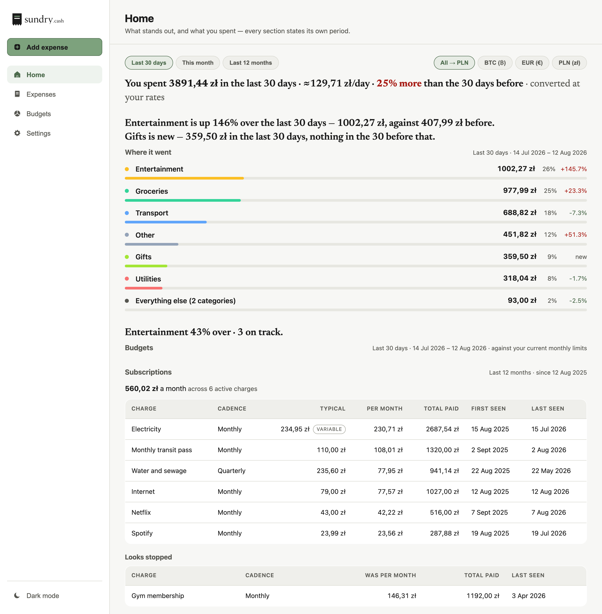
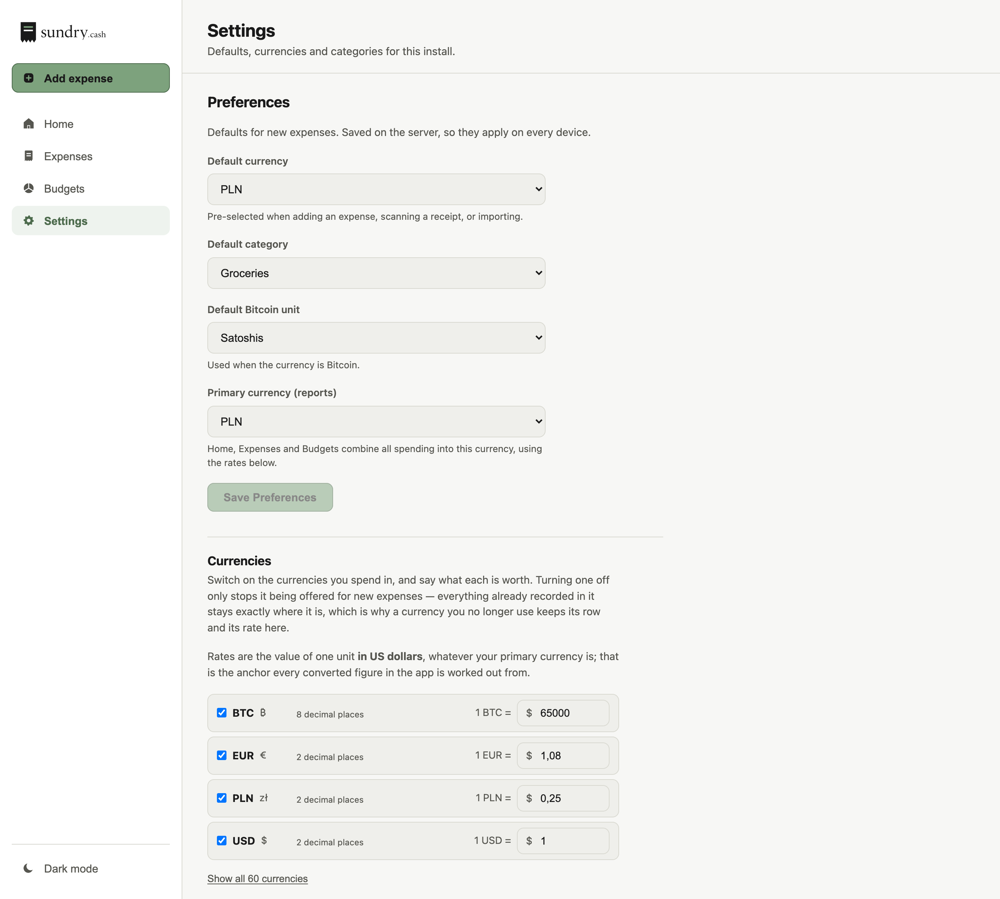

# Sundry

A self-hosted personal expense tracker. Add expenses by hand, snap a photo of a receipt, or bulk-import
a spreadsheet — then see where the money went across categories, time, and three currencies.

Runs entirely on your own hardware. No cloud, no account, no telemetry. One SQLite file holds everything.

**Stack:** TypeScript end to end — Express + better-sqlite3 on the back, React 18 + Vite on the front.




| Budgets | Settings |
| :---: | :---: |
|  |  |

<p align="center">
  
</p>

Two more in [`gallery/`](gallery/): the Add sheet open over a screen, and Home in the dark theme.

## Quickstart

**Docker** — the whole stack behind nginx:

```bash
docker compose up --build
```

Open **http://localhost:8847**. Data persists in `./data`.

**Without Docker** — needs Node 18 or newer:

```bash
npm run install:all && npm run dev
```

Open **http://localhost:5173**. Vite proxies `/api` to the backend on `:5000`, so there is nothing else to
configure. To try the importer, use [`sample-data/sample-expenses.xlsx`](sample-data/sample-expenses.xlsx).

> The Docker images and CI both pin **Node 22**, which is what this is tested on (`.nvmrc` matches). On
> Node releases where better-sqlite3 ships no prebuilt binary it compiles from source, so you would need a
> C++ toolchain and Python installed.

### Sharing it across your devices

Run the stack on an always-on machine and every device on your LAN reaches the same data at
`http://<that-machine's-ip>:8847`. On a phone, open that URL and tap **Add to Home Screen** — it installs
as a full-screen PWA; tap the **+** and choose **Scan a receipt** to go straight to the camera.

> **Set `APP_PASSWORD` before you expose this anywhere.** With no password the API is completely open —
> deliberate, so a localhost-only install needs zero setup, but it means anyone who can reach the port can
> read and delete your data. See [docs/DEPLOYMENT.md](docs/DEPLOYMENT.md) and
> [SECURITY.md](SECURITY.md).

Running more than one instance on a host — a public demo, someone else's ledger — is an env file per
instance and one front proxy: [deploy/README.md](deploy/README.md). Nothing about the app becomes
multi-tenant; each instance stays one container pair with its own SQLite file.

## Features

- **Expenses** — add, edit, delete; search across description/category/amount; filter by category, currency
  and date range; sort by date, category or amount; select rows to bulk-assign a category or bulk-delete.
- **Receipt scanning** — photograph a receipt and the app pulls out amount, date and merchant. OCR runs
  **offline** by default (Tesseract.js, Polish + English), so no image leaves your server. You get a
  confidence score and per-field warnings, and you review and correct everything before it saves; the photo
  is attached to the expense.
- **Excel import** — upload an `.xlsx`, map the columns (common names are auto-detected), preview the first
  ten rows, then import. Handles merged cells, title rows and several date formats, and reports per-row
  errors instead of failing the batch.
- **Auto-categorization** — keyword matching in English and Polish, including Polish chains (Biedronka,
  Lidl, Żabka, Orlen, Castorama…) and utility providers (Tauron, PGE, Enea…). Shared by the importer and
  the receipt scanner. Matching is whole-word, so "scarf" is not transport and "photography" is not a game.
- **Your own categories** — seven ship with the app; add, rename and recolour as many more as you like
  from Settings. Deleting one asks where its expenses should go rather than orphaning them, and the
  seven built-ins stay put because auto-categorization depends on them.
- **Budgets** — a monthly limit per category and currency, and a screen that answers rather than
  displays: "2 over · 1 close · 5 on track" at the top, then the pace (`43% used · day 11 of 31 · on
  pace`) with a tick on each bar showing where the calendar is, then the cumulative burn-down. Step
  back through past months — limits are standing figures with no month of their own, so a past month
  is compared with your current ones and the screen says so. The list reads as text until you press
  **Edit limits**.
- **Multi-currency** — 60 currencies to choose from, three enabled to start (USD, PLN and BTC, the last
  stored to satoshi precision). Each carries its own decimal count, so ¥1,480 is stored and shown as
  whole yen rather than as cents. Totals are grouped per currency by default; set a primary currency and
  Home converts everything into it using your own rates.
- **Home** — the boot screen, and the whole point of the product: what you spent over a window you pick
  (`Last 30 days · This month · Last 12 months`), the categories ranked with their share and their
  change, whether any budget is blown, and then the habits — subscriptions, the shops you keep going
  back to, and when in the week the money goes. Every section prints the window it measured over,
  because the habit sections deliberately use a much longer one than the page control: 30 days leaves
  about four samples per weekday.
- **Findings are the headlines** — the server ranks six kinds of finding (the biggest mover against the
  previous window, anything you started spending on, what your recurring charges cost, one that
  stopped, a shop you visit more than you think, a weekend habit), scoring each against your own
  spending rather than against a fixed amount. Each one it keeps becomes the heading of the section
  that proves it, and the section with a finding far ahead of the rest moves to the top. Nothing is
  shown where there is nothing to say — no empty boxes, no "0" tiles.
- **Export** — the whole ledger as `.xlsx` from the server, or CSV generated in the browser.
- **Optional login** — set `APP_PASSWORD` and the app gates behind a 7-day HMAC bearer token.
- **Light-first UI, mobile layout, installable PWA** — charcoal, sage and off-white, with a dark
  theme that is a full peer rather than a fallback.

## Design notes

The decisions worth explaining, and what I would revisit:

**Money is stored as integer minor units, never floats.** `amount` is an `INTEGER` column holding cents,
grosze or satoshis; the REST API speaks major units and conversion happens only at the model boundary
([`config/money.ts`](backend/src/config/money.ts)). A `REAL` column accumulates binary rounding error —
`0.1 + 0.2 !== 0.3` — which is invisible on one row and wrong on a thousand. BTC forced the issue: two
decimal places would have been useless, so the per-currency scale is explicit (100, 100, 100 000 000).

**better-sqlite3, synchronously.** This is a single-user app on a home server. An async driver plus a pool
would buy concurrency nobody needs, at the cost of every query becoming a promise. The prepared statements
in [`models/`](backend/src/models) are the entire data layer, and there is no ORM.

**Auth is opt-in, not off or on.** Most self-hosted trackers make you invent a password before you can add
your first expense. Here, no `APP_PASSWORD` means no gate — right for `localhost`. Setting it turns on an
HMAC bearer token. The tradeoff is real and stated loudly above rather than hidden in a config file.

**The OCR engine sits behind a provider seam.** [`services/receipt/`](backend/src/services/receipt) picks an
extractor from `RECEIPT_OCR_PROVIDER`; the parsing heuristics are pure functions with their own unit tests,
independent of whichever engine produced the text. Tesseract runs offline today; a hosted vision model can
drop in without touching routes or UI. Scanning is deliberately two-step — extract, then let the human
confirm — because OCR on a crumpled receipt is a suggestion, not a fact.

**What I would do differently.** The frontend and backend keep two hand-maintained copies of the same types
instead of a shared package, and they have already drifted once — a small workspace would have been cheaper
than the discipline. `routes/import.ts` grew business logic that belongs in a service, which is why it is
the least-tested file in the repo. And the importer used to parse amounts with its own regex that silently
deleted the comma — so the European `1 234,56` imported as `123456` — until it was pointed at the parser the
receipt scanner already had; two implementations of one idea is how that happens.

## Configuration

All backend variables are optional. There is no `.env` loading on the backend — export them in the
environment or set them in `docker-compose.yml`. See [`backend/.env.example`](backend/.env.example).

| Variable | Default | Purpose |
| --- | --- | --- |
| `PORT` | `5000` | API listen port |
| `DB_PATH` | `<cwd>/data/expenses.db` | SQLite file. Also roots the receipts and OCR-cache directories |
| `APP_PASSWORD` | *(unset — auth disabled)* | Enables the login gate |
| `AUTH_SECRET` | falls back to `APP_PASSWORD` | HMAC signing key for bearer tokens |
| `AUTH_RATE_LIMIT_MAX` | `10` | Failed logins allowed per IP per 15 minutes |
| `DEMO_MODE` | `false` | Public demo: the UI banners that the data is fictional and resets |
| `RECEIPTS_ENABLED` | `true` | `false` makes `/receipts` answer 403 and hides the tab |
| `RECEIPT_OCR_PROVIDER` | `tesseract` | `tesseract` or `stub`. `claude` is a documented placeholder that throws |
| `RECEIPT_OCR_LANGS` | `pol+eng` | Tesseract language packs |
| `RECEIPTS_DIR` | `<dir of DB_PATH>/receipts` | Where receipt images are written |
| `TESSERACT_CACHE_PATH` | `<dir of DB_PATH>/tesseract` | Cache for downloaded language data |
| `TESSERACT_LANG_PATH` | *(unset)* | Point at local `*.traineddata` for fully offline OCR |

The frontend reads one variable, baked in at build time: `VITE_API_BASE_URL` (default `/api`).

## API

Base URL `http://localhost:5000/api`. Everything except `/health`, `/auth/*` and `/config` requires
`Authorization: Bearer <token>` **when `APP_PASSWORD` is set** — otherwise all routes are open.

| Method | Path | Purpose |
| --- | --- | --- |
| `GET` | `/health` | Liveness check (public) |
| `GET` | `/auth/status` | Whether a password is configured (public) |
| `POST` | `/auth/login` | Exchange password for a 7-day token (public) |
| `GET` | `/config` | What kind of instance this is: `demoMode`, `receiptsEnabled` (public, booleans only) |
| `GET` | `/expenses` | List expenses; filter by `category`, `currency`, `startDate`, `endDate` |
| `POST` | `/expenses` | Create one — `amount`, `date`, `description`, `category`, `currency` all required |
| `GET` | `/expenses/:id` | Fetch one |
| `PUT` | `/expenses/:id` | Partial update |
| `DELETE` | `/expenses/:id` | Delete one, plus its receipt image |
| `DELETE` | `/expenses/all` | Wipe everything and reset the id counter |
| `GET` | `/expenses/export` | Download the ledger as `.xlsx` |
| `GET` | `/expenses/stats/by-category` | Totals grouped by category and currency |
| `GET` | `/expenses/stats/by-date` | Totals grouped by date and currency |
| `GET` | `/expenses/stats/analytics` | Aggregates for a filtered slice |
| `POST` | `/import/preview` | Upload a spreadsheet, get headers + first 10 rows |
| `POST` | `/import/confirm` | Import using a column mapping |
| `POST` | `/receipts/scan` | OCR a photo and return fields for review — creates nothing |
| `POST` | `/receipts` | Create an expense from reviewed fields, attaching the photo |
| `GET` | `/receipts/:filename` | Stream a stored receipt image |
| `GET`, `PUT` | `/budgets` | List limits / upsert one for a category+currency pair |
| `DELETE` | `/budgets/:category` | Remove a limit (`?currency=` required) |
| `GET`, `POST` | `/categories` | List categories in display order / add one — `slug`, `label`, `color` |
| `GET` | `/categories/suggest` | Guess a category from a description — `?description=`, answers `other` when nothing matches |
| `PUT` | `/categories/:slug` | Change `label`, `color` or `sortOrder`; the slug itself is fixed |
| `DELETE` | `/categories/:slug` | Delete one — 403 for a built-in, 409 if in use without `?reassignTo=` |
| `GET` | `/insights/comparison` | Spend per category vs the period before — `window`, `period`, `anchor`, `currency` |
| `GET` | `/insights/recurring` | Repeating charges and what each costs per month — `since`, `minOccurrences` |
| `GET` | `/insights/merchants` | Spend per merchant, small purchases included — `since`, `until`, `currency`, `limit` (per currency) |
| `GET` | `/insights/patterns` | Weekend against weekday spend, per day — `since`, `until`, `currency` |
| `GET` | `/insights/summary` | The four above, scored against each other, top findings only — `scope`, `limit`, `anchor` |
| `GET` | `/currencies` | The currency catalogue, enabled entries first |
| `PUT` | `/currencies/:code` | Enable or disable one — `{ enabled }` is the only field |
| `GET`, `PUT` | `/fx` | Read / set manual exchange rates |
| `GET`, `PUT` | `/settings` | Read / update preferences |

## Data model

Six tables — `expenses`, `budgets`, `categories`, `currencies`, `fx_rates`, `settings` — created
idempotently on boot.

**Categories** are rows, not an enum. `expenses.category` and `budgets.category` are foreign keys into
`categories(slug)`, so adding one is a `POST`, not a migration. Seven ship built-in — `groceries`,
`transport`, `media`, `entertainment`, `utilities`, `maintenance`, `other` — each carrying a label,
a colour and a sort order you can edit. Built-ins cannot be deleted: the keyword auto-categorizer can
emit any of them, and the importer falls back to `other`. Deleting a category that is still in use
requires naming where its rows should go.

**Currencies** are rows too, but you can only switch them on and off — never invent one. The row
carries the **minor-unit exponent**, and that is what decides how every amount is stored: a wrong
exponent does not fail, it silently reinterprets your history (5099 cents becoming 5.099 of
something). So the app ships a catalogue of 60 currencies with the exponent already right — including
every ISO 4217 currency that is *not* two decimals, because those are the ones a guess gets wrong
(JPY has none, KWD has three, CLF has four) — plus BTC as an explicit non-ISO entry with its satoshi
handling. `USD`, `PLN` and `BTC` are enabled out of the box; enabling EUR is one click.

Once anything is recorded in a currency its exponent is frozen, enforced in the model rather than
just the UI. Disabling a currency stops it being offered for new entries and never touches the
history already in it. See [`docs/categories-currencies-spec.md`](docs/categories-currencies-spec.md).

**Exchange rates** are manual and user-editable — there is no live feed, because the app is meant to run
offline. A rate is the value of one unit in USD; seeds are `USD 1`, `PLN 0.25`, `BTC 65000`.

## Development

```bash
npm run install:all   # root + backend + frontend
npm run dev           # both servers, backend :5000 + Vite :5173
npm run build         # typecheck and build both packages
npm run test          # backend Jest, then frontend Vitest
```

Tests: **273 backend cases** across 15 files (Jest + supertest) and **432 frontend cases** across 22 files
(Vitest + Testing Library) — every component has a suite, plus the API wrapper and the FX helper. The
backend suite redirects `DB_PATH` to a temp directory before any app module loads, so running it never
touches your real database. CI ([`.github/workflows/ci.yml`](.github/workflows/ci.yml)) lints, typechecks,
builds and tests both packages, and builds the Docker images.

## Limitations

Worth knowing before you rely on it:

- **Single user.** One password, one ledger. No accounts, no sharing model, no per-user data.
- **The whole ledger is fetched in one request.** The table pages 50 rows at a time so the DOM stays
  small, but Home's heatmap and the ledger's two charts need every row to draw, so there is no
  server-side paging. Fine for the thousands of expenses a person actually records; not built for a
  hundred thousand.
- **Manual FX rates.** No live feed by design.
- **No recurring expenses**, no income tracking, no attachments beyond receipt photos.
- **Backups are your job**, but the database runs in WAL mode so it can be snapshotted while running:
  `sqlite3 data/expenses.db ".backup 'backup/expenses.db'"`. Back up the whole `data/` directory — it
  holds the receipt images too. Recipes in [docs/DEPLOYMENT.md](docs/DEPLOYMENT.md).

## Security

Auth is opt-in, this is meant for a machine you control, and one dependency (`xlsx`) carries
advisories with no upstream fix. All of that is written down in [SECURITY.md](SECURITY.md) rather
than left for you to find in a Dependabot alert.

## License

[MIT](LICENSE).
